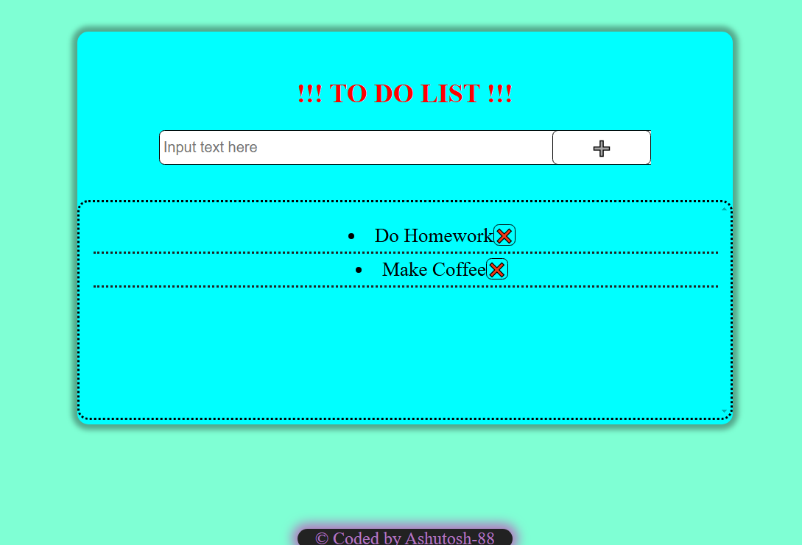

# To Do List



Simple ToDoList.

## Description

This is a simple To Do List where you can add multiple tasks and remove it as per your wish.

## Getting Started

### Dependencies

- A modern web browser (e.g., Google Chrome, Firefox, Edge)
- No special libraries or frameworks are required
- Operating system: Windows, Mac, or Linux

### Installing

1. Clone or download the repository to your local machine:

```sh
git clone https://github.com/Ashutosh-88/-Simple--ToDoList
```

2. Navigate to the project folder in your terminal:

```sh
cd -Simple--ToDoList
```

3. Open the `index.html` file in your web browser.

### Executing Program

1. To open the app, simply open the `index.html` file in your browser.
2. The input field will appear where you can input the task that is to be added.
3. To Add that task, click ➕ button.
4. To Remove that task, click ❌ button
5. This app utilizes localStorage. So, task is not removed after refreshing the page until it is manually removed.

## Help

If you run into any issues, ensure you are using a compatible browser and that JavaScript is enabled. If you need more help, please check the browser console for any error messages.

## Authors

- [Ashutosh Tiwari](https://www.linkedin.com/in/ashutosh-tiwari-70b504190/)

## Version History

- 0.1
  - Initial Release

## License

This project is licensed under the [MIT License](https://opensource.org/licenses/MIT) - see the LICENSE.md file for details.
